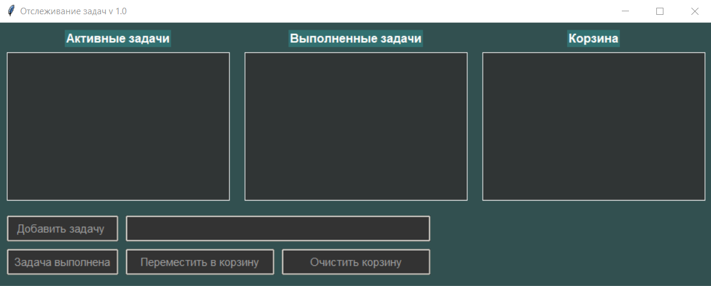

# Простой менеджер задач на Python v1.1
### Менеджер задач с тремя списками
- полноценный **оконный интерфейс**
- **отдельное поле** для ввода новых задач
- **три списка:** активные, выполненные и корзина
- реализовано **перетаскивание задач** как внутри
текстового поля, так и между полями
- **кнопки:**
  - добавить задачу
  - задача выполнена
  - переместить в корзину
  - очистить корзину 
  ### Примущества: малый размер окна и удобный интерфейс
